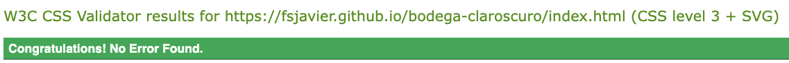

# Bodega Claroscuro

Welcome to Bodega Claroscuro, a fictional business located in northern Spain. The winery produces their own red and white wines, capturing the essence of the region.

The website serves as an online presence to engage wine enthusiasts, offering the possiblity to know more about winemaking and high-quality wines, which can be then purchased.

## User Goals

* As a new user, I want to:
  1. Know what wines are produced, their characteristics and price.
  2. Learn about the winemaking process.
  3. Discover the location and opening times.
  4. Find out how to contact them.

* As a returning user, I want to:
  1. Stay updated on any changes or news.
  2. Know the current offered wines.
  3. Easily access the contact information.

## Features

### Home

* Navigation Bar
  * The navigation bar is present in all pages. It keeps always the same position for consistency and to make it easier for user to navigate the website.
  * It includes the logo (clickable, linking to the home page) and links to "Home", "Oud wines" and "Contact". It's responsive, on wide screen the logo is on the left side and the navigation bar on the right, while on smaller screens the navigation bar moves under the logo.

* Landing Page image
  * An image of the vineyard at sunset occupies the majority of the screen. As specialists in both white and red wines, this carefully chosen moment captures the essence of the winery, where the interplay of light and darkness symbolizes the meaning behind the name, Claroscuro.

* The latest from the vineyard section
  * This section has a double purpose: 
    * Give a direct way to access the wines available with the call to action "Discover our wine selection".
    * Offer information about the winery, which will be periodically updated with news like the production of a new wine.
 
 

* Get in touch section
  * Here users are informed about the possibility of visiting the winery and are encouraged to contact with the call to action "Request information"

* Footer
  * Like with the navigation bar, its design is responsive and consistent in all pages.
  * It includes the shop opening hours and the links to social media, which open in a new tab.

### Our wines

* This page gives an overview of all available wines, split into two sections: Red wines and White wines.
* Each wine is contained in a card like box to separate visually each of them. The cards contain a description of the wine and its price.
* The design is responsive, with two columns of cards for wide screens and the image of the bottle and text next to each other. For mid size screen there is only one column of cards. For the smallest screens there is also one column and the text moves below the image.

* Navigation Bar and Footer described above.

### Contact

* This page is divided in two parts: a contact form and the location.
  * The contact form section is the way for users to request information or provide feedback. It has 3 mandatory fields (first name, last name and email) and optional message and checkbox to receive emails with the latest news and offers.
  * The location section contains key points for users who want to visit the winery and shop including a embeded map.
  * The design is responsive, with the sections next to each other on wide screens and the location section moving below the contact form on small screens.

* Navigation Bar and Footer described above.

### Features left to implement

* Add an "about us" page, with information dedicated to the winery and its winemaking process.
* Add online shop functionality, so that users can purchase wine online and have it delivered.
* Make the wines section more interactive - Replace the current style by images of just the bottle and wine name, giving then the user the option to navigate to a details page of each wine with a more thorough description.

## Design

### Wireframes

* Home

* Our wines

* Contact

## Technologies Used

### Languages

* HTML for the sctructure of the website.
* CSS for the style.

### Frameworks and tools

* [Codeanywhere](https://codeanywhere.com) was the IDE used to develop the website.
* Git was used for version control.
* [GitHub](https://github.com) is used to host the code and deploy the website.
* [Balsamiq](https://balsamiq.com/wireframes) was used to create the wireframes.
* [Google Fonts](https://fonts.google.com) was used to import the Montserrat and Poiret One fonts.
* [Font Awesome](https://fontawesome.com) was used to import the icons.
* [TinyPNG](https://tinypng.com) was used to compress the images.
* [Convertio](https://convertio.co) was used to convert the images to webP.

## Testing

### Validator Testing

#### HTML

All pages passed without errors or warning through the the W3C Markup Validation Service.

* Home page

* Our wines page

* Contact page

#### CSS

No errors were found through the W3C Jigsaw CSS Validation Service. The report can be found [here](documentation/tests/test_css_report.pdf).

### Accessibility
 
#### Lighthouse

Lighthouse from Google Chrome Developer Tools was used to test performance and accessibility.
    
* Home
    

* Our wines

* Contact

  
#### Wave WebAIM

The WAVE WebAIM web accessibility tool was used during the dvelopment and for final testing of the website to check there were no accessibility problems.

No errors were found, the only alert was due to redundant links. This was due to having the same links in the navigation bar and some other parts of the website (e.g. the link to home in the logo.).

### Manual Testing

#### User goals fulfillment

| Type of user | Goal | Steps | Feature | Outcome |
|--------------|------|-------|---------|---------|
| New / Returning | Know what wines are produced, their characteristics and pricing. | Option 1: Go to "Our wines" on the top navigation bar.   Option 2: Scroll down to "The latest from the vineyard" and click on "Discover our wine selection". | Option 1: Navigation bar.    Option 2: The latest from the vineyard section. | Works as expected. |
| New | Learn about the winemaking process. | At the moment this can only be done requesting a tour.  Option 1: Go to "Contact" on the top navigation bar.   Option 2: Scroll down to "Get in touch" and click on "Request information".   From there, fill out the contact form. | Option 1: Navigation bar.    Option 2: Get in touch section.  Contact form. | Works as expected. |
| New | Discover the location and opening times. | Opening times are located at the footer of each page and on the "contact page".  Option 1: Go to "Contact" on the top navigation bar.   Option 2: Scroll down to "Get in touch" and click on "Request information".  See "Where to find us section". | Option 1: Navigation bar.    Option 2: Get in touch section.  Footer  Where to find us section. | Works as expected. |
| New / Returning | Find out how to contact the winery. | Option 1: Go to "Contact" on the top navigation bar.   Option 2: Scroll down to "Get in touch" and click on "Request information".   From there, fill out the contact form. | Option 1: Navigation bar.    Option 2: Get in touch section.  Contact form. | Works as expected. |
| Returning | Stay updated on any changes or news | Option 1: Scroll down to "The latest from the vineyard section".   Option 2: Request to receive news per email through the contact page.   From there, fill out the contact form, checking the box. | Option 1: The latest from the vineyard section.    Option 2: Get in touch section.  Contact form. | Works as expected. |

#### Functional testing

All links have been tested to ensure they load the right page without errors.

* Navigation bar
  * The link in the logo links to the homepage
  * The menu links navigate to the "Home", "Our wines" and "Contact" pages respectively.
  * The active page is highlighted with a bigger font and a glass of wine icon.
  * Hovering over an inactive page in the menu increases its size.

* Footer
  * All socia media links open its respective page (Facebook, Twitter, Youtube, Instagram) in a new tab.

* Hovering over the link with the text "Discover our wine selection" in "The latest from the vineyard" section higlights it changing its color. Clicking on it loads "Our wines" page.

* Hovering over the link with the text "Request Information" in "Get in touch" section higlights it changing its color. Clicking on it loads "Our wines" page.

* Form in Contact page
  * The first three fields are required and the form can't be submitted unless they are filled out.
  * Sending a form loads the "Thank you" page.

* The embedded Google Map is displayed correctly and can be interacted with.

#### Responsiveness

### Bugs

## Deployment

## Credits

### Content

### Media
